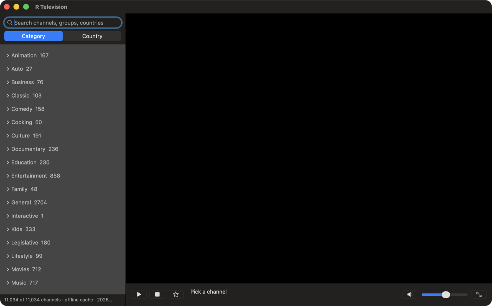
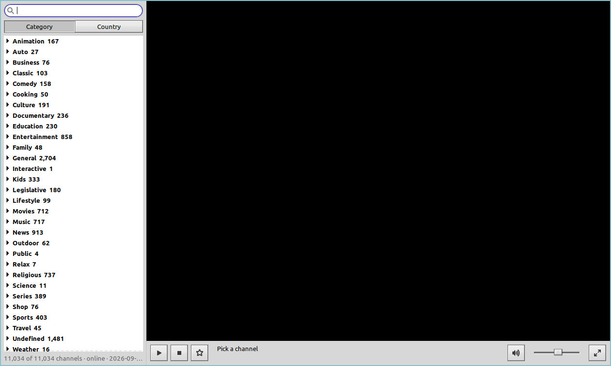
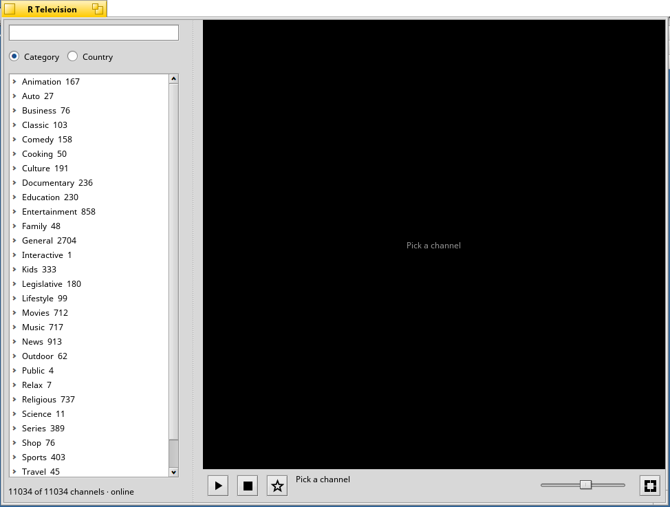

#  R Television

Un lettore per i canali TV gratuiti di tutto il mondo: i canali a sinistra,
l'immagine a destra. L'interfaccia segue la lingua del sistema (inglese,
italiano, giapponese o coreano).

[English](README.md) · Italiano · [日本語](README.ja.md) · [한국어](README.ko.md)

## Cosa serve

| Sistema | Come si installa | Cos'altro serve |
|---|---|---|
| macOS 11 o successivo, Apple Silicon o Intel | si scarica l'app | niente |
| Linux x86_64: Debian, Ubuntu, Linux Mint | si compila con un solo comando | una connessione a internet e, una volta, la tua password |
| Haiku x86_64 | si compila con un solo comando | una connessione a internet |
| Haiku arm64 | si compila con un solo comando | FFmpeg preparato prima (vedi [Haiku](#haiku)) |

Non serve installare VLC da nessuna parte: R Television ha il suo.

## Installazione

### macOS



1. Scarica `R-Television-1.0.0-macOS.dmg`.
2. Aprilo e trascina **R Television** in **Applicazioni**.
3. Apri R Television da Applicazioni.

L'app non è firmata con un Developer ID di Apple, perciò la prima volta macOS la
blocca. Basta sbloccarla una volta, nel modo che preferisci:

- **macOS 15 e successivi:** dopo l'avviso apri **Impostazioni di Sistema >
  Privacy e sicurezza**, scorri fino a *"R Television" è stato bloccato* e fai
  clic su **Apri comunque**.
- **Da macOS 11 a 14:** fai clic sull'app in Applicazioni tenendo premuto Ctrl,
  scegli **Apri** e poi di nuovo **Apri**.
- **Dal Terminale, con qualsiasi versione** (risolve anche il messaggio
  *"è danneggiata e non può essere aperta"*):

  ```sh
  /usr/bin/xattr -dr com.apple.quarantine "/Applications/R Television.app"
  ```

Da quel momento si apre come qualsiasi altra app.

### Linux



1. Scarica questo progetto come file ZIP e decomprimilo (oppure clonalo con
   `git`).
2. Apri un terminale nella cartella decompressa ed esegui:

   ```sh
   cd platforms/linux
   ./install.sh
   ```

   Lo script installa ciò che manca tra il compilatore e i pacchetti di sviluppo
   di GTK e curl (può chiederti la password), poi compila R Television e lo
   installa nella tua cartella personale.
3. Avvia **R Television** dal menu delle applicazioni, oppure esegui
   `r-television`.

Provato su Linux Mint 20.3 e Ubuntu 20.04.

### Haiku



1. Scarica questo progetto come file ZIP e decomprimilo.
2. Apri il Terminale nella cartella decompressa ed esegui:

   ```sh
   cd platforms/haiku
   ./install.sh
   ```

   I pacchetti mancanti (`gcc`, `haiku_devel`) vengono installati con `pkgman`;
   il resto del sistema non viene toccato.
3. Avvia **RTelevision** da **Deskbar > Applications**.

Su **arm64** Haiku non ha pacchetti né di VLC né di FFmpeg, quindi FFmpeg va
compilato su un altro computer prima del passo 2. I passaggi sono in
[AGENTS.md](AGENTS.md#haiku-arm64-ffmpeg) (in inglese).

## Disinstallazione

macOS:

```sh
rm -rf "/Applications/R Television.app"
rm -rf ~/Library/Application\ Support/RTelevision
```

Linux (dalla cartella del progetto):

```sh
cd platforms/linux && make uninstall
```

Haiku:

```sh
rm -f ~/config/non-packaged/apps/RTelevision ~/config/settings/deskbar/menu/Applications/RTelevision
rm -rf ~/config/non-packaged/data/RTelevision ~/config/settings/RTelevision
rm -rf ~/config/non-packaged/apps/vlc ~/config/non-packaged/apps/libvlc*.so* \
       ~/config/non-packaged/apps/libav*.so* ~/config/non-packaged/apps/libsw*.so*
```

L'ultima riga di Haiku rimuove le librerie multimediali che R Television ha
copiato accanto a sé; saltala se le usa anche un altro tuo programma.

La seconda riga di macOS e la cartella `settings` di Haiku contengono la cache
dei canali e i tuoi preferiti.

## Licenza

MIT, vedi [LICENSE](LICENSE). Le librerie VLC e FFmpeg incluse mantengono le
proprie licenze, elencate in [THIRD-PARTY-NOTICES.md](THIRD-PARTY-NOTICES.md).
La lista dei canali proviene da [iptv-org/iptv](https://github.com/iptv-org/iptv)
e segue la licenza di iptv-org.

## Nota sull'uso dell'IA

Questo programma è stato scritto insieme a Claude.
