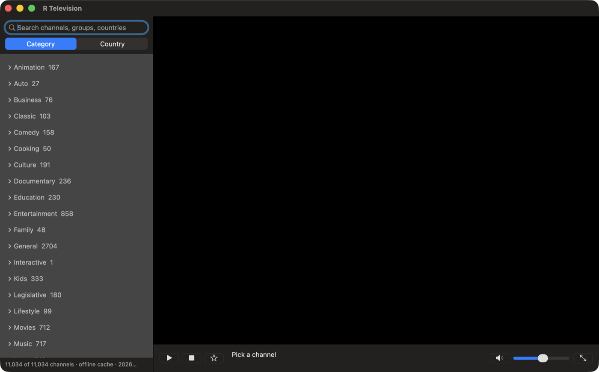
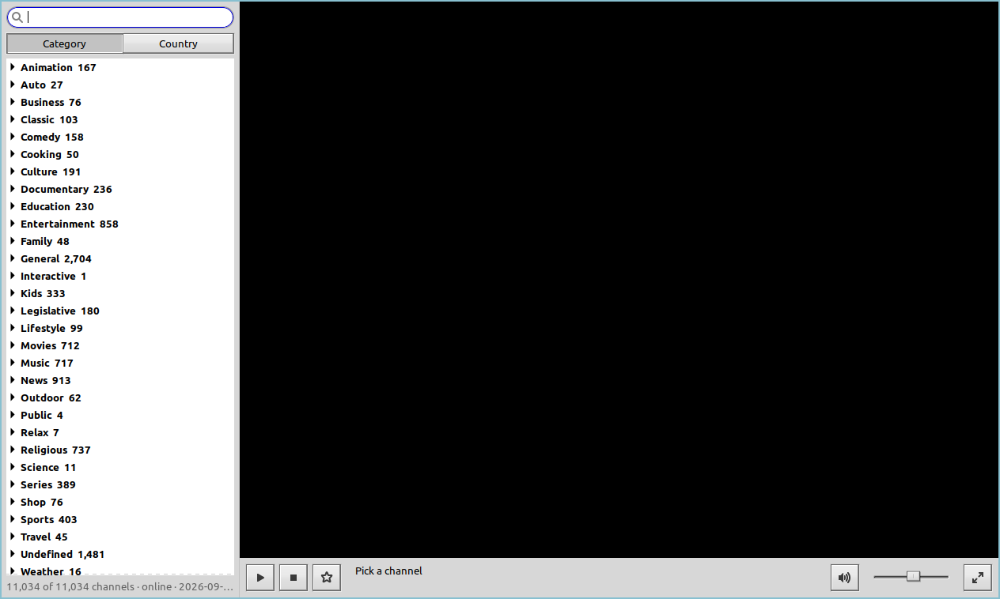
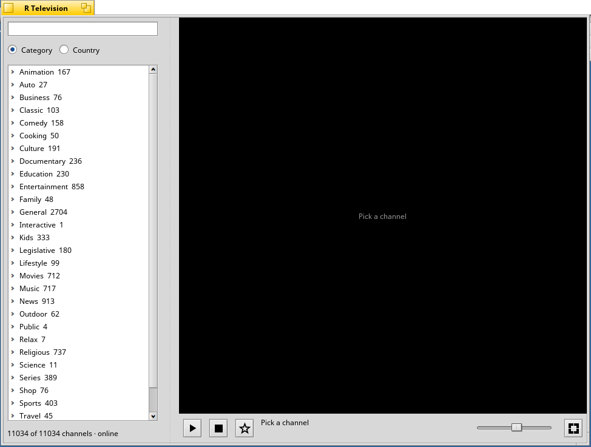

#  R Television

世界中の無料 TV ストリーミングを見るプレイヤーです。左にチャンネル、右に映像。
画面の言語はシステムの設定に合わせて切り替わります(英語・イタリア語・日本語・韓国語)。

[English](README.md) · [Italiano](README.it.md) · 日本語 · [한국어](README.ko.md)

## 必要なもの

| システム | インストール方法 | ほかに必要なもの |
|---|---|---|
| macOS 11 以降(Apple Silicon または Intel) | アプリをダウンロード | なし |
| Linux x86_64: Debian、Ubuntu、Linux Mint | コマンド一つでビルド | インターネット接続と、一度だけパスワード |
| Haiku x86_64、32 ビット x86、arm64 | `pkgman` でインストール | インターネット接続 |

どの環境でも VLC をインストールする必要はありません。R Television が自前で持っています。

## インストール

### macOS



1. [`R-Television-1.0.0-macOS.dmg`](platforms/macos/dist/R-Television-1.0.0-macOS.dmg) をダウンロードします。
2. 開いて **R Television** を **アプリケーション** にドラッグします。
3. アプリケーションフォルダから R Television を開きます。

このアプリは Apple の Developer ID で署名していないため、最初は macOS に止められます。
次のどれか一つの方法で、一度だけ許可してください。

- **macOS 15 以降:** 警告が出たあと **システム設定 > プライバシーとセキュリティ** を開き、
  *"R Television" はブロックされました* までスクロールして **このまま開く** をクリックします。
- **macOS 11〜14:** アプリケーションフォルダでアプリを Control キーを押しながらクリックし、
  **開く** を選んで、もう一度 **開く** を押します。
- **ターミナル(どのバージョンでも可。「壊れているため開けません」と表示される場合も
  これで解決します):**

  ```sh
  /usr/bin/xattr -dr com.apple.quarantine "/Applications/R Television.app"
  ```

一度許可すれば、あとは普通のアプリと同じように開けます。

### Linux



1. このプロジェクトを ZIP ファイルでダウンロードして展開します(`git` で clone しても
   構いません)。
2. 展開したフォルダでターミナルを開き、次を実行します。

   ```sh
   cd platforms/linux
   ./install.sh
   ```

   コンパイラと GTK・curl の開発パッケージのうち足りないものをインストールし(パスワードを
   聞かれることがあります)、R Television をビルドしてホームフォルダにインストールします。
3. アプリケーションメニューから **R Television** を起動するか、`r-television` を実行します。

Linux Mint 20.3 と Ubuntu 20.04 で確認しています。

### Haiku



R Television は Haiku のすべてのアーキテクチャ向けにパッケージがあり、メディア
ライブラリを同梱しているので VLC を別に入れる必要はありません。

```sh
pkgman add-repo https://pkgman.rainygirl.com/$(getarch -p)
pkgman install rtelevision
```

32 ビットの x86_gcc2 イメージではアプリがセカンダリアーキテクチャでビルドされる
ため、パッケージ名は `rtelevision_x86` です。

```sh
pkgman install rtelevision_x86
```

そのあと **Deskbar > Applications** から **R Television** を起動します。RENKU
arm64 イメージにはこのリポジトリが登録済みです。

自分でビルドする場合は、このプロジェクトを ZIP ファイルでダウンロードして展開し、
そのフォルダでターミナルを開いて次を実行します。

```sh
cd platforms/haiku
./install.sh
```

足りないパッケージ(`gcc`、`haiku_devel`)は `pkgman` でインストールします。
システムのほかの部分には手を触れません。ビルドの詳細は
[AGENTS.md](AGENTS.md#haiku)(英語)にあります。

## アンインストール

macOS:

```sh
rm -rf "/Applications/R Television.app"
rm -rf ~/Library/Application\ Support/RTelevision
```

Linux(プロジェクトのフォルダで):

```sh
cd platforms/linux && make uninstall
```

Haiku:

リポジトリから入れた場合:

```sh
pkgman uninstall rtelevision        # rtelevision_x86 on the x86_gcc2 image
rm -rf ~/config/settings/RTelevision
```

自分でビルドした場合:

```sh
rm -rf ~/config/non-packaged/apps/RTelevision ~/config/settings/deskbar/menu/Applications/RTelevision
rm -rf ~/config/non-packaged/data/RTelevision ~/config/settings/RTelevision
```

macOS の 2 行目と Haiku の `settings` フォルダには、チャンネル一覧のキャッシュと
お気に入りが入っています。

## ライセンス

MIT です([LICENSE](LICENSE))。同梱の VLC と FFmpeg のライブラリはそれぞれのライセンス
のままで、[THIRD-PARTY-NOTICES.md](THIRD-PARTY-NOTICES.md) にまとめてあります。
チャンネル一覧は [iptv-org/iptv](https://github.com/iptv-org/iptv) のデータを参考にしており、
そのライセンスは iptv-org のものに従います。

## AI 利用について

このプログラムは Claude と一緒に作りました。
